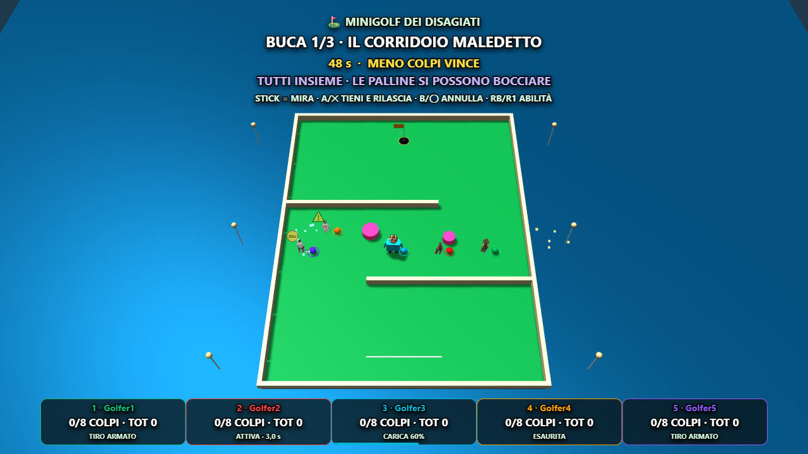
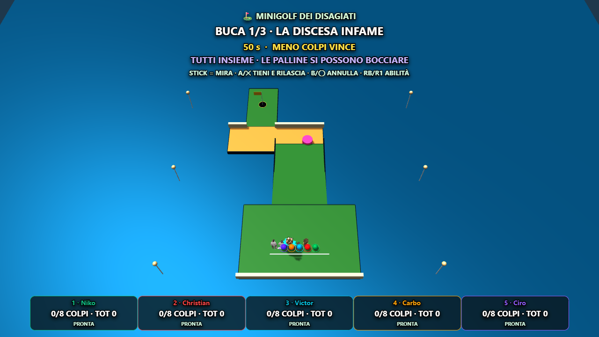

# MINIGOLF DEI DISAGIATI — report di integrazione

Data: 10 ottobre 2026. Minigioco ufficiale #13, ID `minigolf`. Baseline `d9934d8`; implementazione root autorizzata, nessun servizio a pagamento, nessun asset nuovo generato. Commit locale dedicato della fase; nessun push/deploy.

## Funzionamento

Da due a cinque giocatori simultanei, palline personali con colori dei personaggi e collisioni reciproche. Tre buche diverse estratte come facile/media/difficile. Ogni buca dura al massimo 50 secondi, con introduzione di 4 secondi e transizione di 3. Massimo teorico della simulazione: 168 secondi, più CONTROLLI e presentazione risultati. Chi imbuca scompare dalla superficie giocabile e attende il percorso successivo.

Limite iniziale: 8 colpi. L'ottavo tiro può ancora imbucare mentre rotola. Mancato completamento: almeno 10 colpi, oppure colpi già accumulati +2 se maggiore; le penalità precedenti restano valide. Fuori pista: +1 e ritorno all'ultima zona sicura. Stallo tecnico/non-finite: ripristino senza penalità. Classifica: meno colpi, meno penalità, più hole-in-one, minor tempo, ordine roster per la parità perfetta. Solo ScoreManager assegna i punti della partita generale.

## Sei piste

| Percorso | Difficoltà | Sfida |
|---|---|---|
| Il Corridoio Maledetto | Facile | Due curve, sponde e bumper centrale, passaggi da dosare |
| La Rotonda del Disagio | Media | Due bracci rotanti che trasferiscono impulso; percorso esterno possibile |
| Il Ponte del Litorale | Media | Corsia stretta sospesa, pendenza e ponte traslante, cadute |
| Il Flipper dei Coglioni | Media | Cinque bumper elastici, ghiaccio e sabbia |
| La Discesa Infame | Difficile | Discesa di 3 metri, curva su sabbia, imbocco stretto alla buca |
| L'Ultima Buca | Difficile | Rampa e salto centrale su piattaforma mobile oppure corsia laterale più lunga |

Layout fissi, nessun ostacolo piazzato casualmente. Selezione di tre percorsi senza ripetizioni. Test della continuità del supporto e della luce libera lungo le rotte; controllo fisico dell'accesso finale della Discesa. Corretto un muro che chiudeva inizialmente l'imbocco.

## Fisica e input

Simulazione TypeScript pura, indipendente da Babylon: passo fisso 1/120 s, ulteriori sottopassi spaziali inferiori a un terzo del raggio, includendo la velocità dei bracci. Attrito diverso per erba/sabbia/ghiaccio, gravità sui pendii e in volo, restituzione sui muri, velocità relativa per gli ostacoli rotanti, impulso fra palline con masse uguali. Il contatto richiede compenetrazione reale: la vicinanza non frena. La buca cattura soltanto a velocità contenuta e quota corretta.

Stick sinistro: direzione. A/✕ tenuto: carica; rilascio: tiro. B/◯: annulla; RB/R1: abilità. Direzione del pad trasformata nello spazio della camera: destra dello stick corrisponde a destra sullo schermo. Bot e fisica utilizzano coordinate del mondo.

Telefono: joystick, TIRA tenuto/rilasciato, ANNULLA e ABILITÀ con stato live. Due dita indipendenti. Pointer cancel, perdita del focus, pausa e disconnessione cancellano la carica prima del rilascio; nessun tiro fantasma. Durante il movimento della pallina il nuovo tiro è bloccato. Il pairing e il networking esistenti sono riutilizzati.

## Cinque abilità

Tutti i valori degli effetti nel catalogo centralizzato, un uso per buca, reset al cambio percorso, stato unico pubblicato da AbilityHub sulla TV e sulle Companion Card.

| Personaggio | Abilità | Parametri iniziali |
|---|---|---|
| Goblin | N'CULO, DE SPONDA! | Primo impulso di rimbalzo statico ×1,35, poi consumato; i bracci non consumano il bonus |
| BOSCHI | TU QUA NON ENTRI! | Bumper per 5 s, raggio 0,55, impulso extra 4; davanti a 1,3 m, vietato entro 2,5 m da buca/spawn o sulle piattaforme mobili |
| Victor | M'HO SVEJATO | Previsione per 7 s, simulazione di 2,5 s delle sole sponde statiche; esclude palline e ostacoli mobili |
| Carbo | NO, ASPETTA! | Velocità orizzontale ×0,12 mentre rotola; non annulla il volo |
| Ciro | PAGO DOMANI | Tiro ×1,35; imbucata diretta entro 6 s abbuona un colpo, minimo 1/buca; altrimenti +1 una sola volta. Un secondo tiro chiude il debito precedente |

Il bumper colpisce anche BOSCHI. I risultati non attribuiscono punti per collisioni o ripristini. La bocciata consuma un normale tiro.

## Grafica, personaggi e audio

Camera unica, campo intero dentro l'area sicura. Palline/anelli colorati piccoli ma visibili anche dietro un personaggio; niente nomi neri sopra le teste. Nomi e colpi in cinque righe compatte nella fascia inferiore. Potenza, stato dell'abilità, completamento e avvisi brevi non coprono il campo.

Riutilizzati Goblin, BOSCHI, Carbo e Ciro Tripo originali; Victor mantiene il modello procedurale già presente. Verificati quattro stati `ready` più un `procedural`. Mazza 3D separata, segue l'attacco della mano attiva anche nel fallback. Idle, abilità, esultanza e sconfitta esistenti; backswing e colpo provvisori con inclinazione procedurale del personaggio e rotazione della mazza.

Ombre leggere, acqua scenografica, bandiera, materiali erba/sabbia/ghiaccio, scintille e scie in pool. Geometria della pista precedente e shadow caster rimossi a ogni cambio. Feedback audio sintetizzato per colpo, urti, buca e penalità; tema musicale dedicato e stinger. Annunci comici testuali compatti accompagnati da suoni, senza nuovo doppiaggio.

## File

Nuovi moduli in `src/minigames/minigolf/`: `index.ts`, `MinigolfScene.ts`, `BabylonMinigolfGame.ts`, `minigolfTypes.ts`, `minigolfCourses.ts`, `minigolfPhysics.ts`, `minigolfRules.ts`, `minigolfAbilities.ts`, `minigolfBot.ts`, `minigolfHud.ts`, `minigolfVisuals.ts`. Telefono: `src/controller/minigolfController.ts`.

Integrazioni additive: `shared/minigames.ts`, `shared/abilityCatalog.ts`, `src/input/profiles.ts`, `src/minigames/preload.ts`, `src/core/musicThemes.ts`, `src/core/AudioManager.ts`, `src/controller/main.ts`, `src/controller/style.css`. Due piccoli punti comuni necessari: cancellazione su disconnessione Minigolf in `GameManager.ts`; accessor di sola lettura `rightHandPosition()` in `arenaEntity.ts`. Nessun cambiamento a fisica/abilità degli altri giochi, ScoreManager, FSM, rullo o pairing.

Test: `scripts/minigolf-selftest.ts`, `scripts/e2e/minigolf-core.mjs`, `minigolf.mjs`, `minigolf-rounds.mjs`, `minigolf-production.mjs`. Aggiornati conteggio del catalogo in `ability-selftest.ts`, durata massima in `rounds-selftest.ts`; `matrix.mjs` include ora anche Minigolf e accetta un tempo opzionale di attesa per verificare giochi completamente caricati. Minigolf passa anche il ciclo di vita del test matrix. Piano, checkpoint, log, JSON e PNG sono in questa cartella. `dist/index.html` è il risultato locale del build, escluso dal commit insieme agli asset compilati: resta aggiornato per consentire la prova immediata su :3001.

## Verifiche eseguite

- Typecheck dopo le milestone e build finale PASS (Vite 3m56s; avviso già esistente per chunk Babylon grandi): vedere `typecheck.log` e `build.log`.
- Fisica pura PASS: attrito/stop, 20/30/60/144 FPS contro 120, palline veloci contrapposte, muro ad alta velocità, assenza di frenata per vicinanza, pendenze, sabbia/ghiaccio, bracci, trasporto della piattaforma, caduta/reset, buca e overshoot, corruzione tecnica, carica/rilascio/cancel/versione cancellazione, abilità, limite ottavo tiro e tutti i criteri di ranking. Ciro diretto/timeout/secondo tiro e Goblin primo muro contro braccio verificati separatamente.
- Browser 2 telefoni: tocchi reali carica/rilascio/annullamento, imbucata fisica, risultato e cleanup. Browser 5 giocatori: Xbox/DualSense/generico emulati attraverso GamepadManager e InputManager reali, due telefoni con eventi touch reali. Direzione verificata anche tramite proiezione sullo schermo; pausa, rimozione/reinserimento pad, reload del telefono, ownership delle due dita e nessun tiro residuo.
- Tutte le cinque abilità attivate tramite pad/telefono, Companion Card TIRO ARMATO e telefono ESAURITA controllati e fotografati. Tre buche naturali, classifica server e lobby per 2/3/4/5p: `natural-rounds.json`. Queste prove accelerano il tempo della simulazione attraverso gli stessi comandi dei bot; non iniettano `finish()` né risultati.
- Sei percorsi e 1280×720, 1366×768, 1920×1080, 800×600: screenshot aperti e controllati; test numerico delle palline/buca dentro l'inquadratura e righe HUD dentro il viewport. Foto telefono e Companion Card verificate.
- Pad selftest PASS; catalogo 1064/1064; rounds 54 controlli; audio, presentazione personaggi e solo bots PASS. Regressioni pure Arena combat/survival, proiettili Cornicione, FPS ADS, etichette Calcio, contatti Kart, obiettivi Casa Carbo e Quiz PASS.
- Dodici giochi precedenti: avvio host + due telefoni, risultati → rullo e cleanup verificati da `matrix.mjs`. Questa regressione forza la conclusione per controllare il ciclo di vita, non certifica partite complete dei vecchi giochi. Prima esecuzione 11/12: FPS ha sollevato un errore shader durante chiusura precoce; ripetizione dopo 10 s di caricamento PASS (`regression-fps-browser.log`). Codice FPS invariato; l'abbandono durante compilazione rimane un caso separato da approfondire.
- Produzione PASS: selezione #13 dall'interfaccia normale, un telefono reale nel browser + quattro bot (cinque personaggi), quattro GLB originali HTTP200, chunk precaricato durante rullo/intro, tre buche senza accelerazione, classifica naturale e nessun pageerror (`production.json`). Durata dalla raccolta dopo l'avvio: 95.6 s, 20 tocchi di tiro automatici sul telefono; conclusione anticipata quando tutti finiscono o raggiungono il limite. Punti assegnati da ScoreManager: 10/7/5/3/1.

Hardware dei pad emulato: resta necessaria una prova con controller fisici e telefoni reali sulla LAN.

## Prestazioni

Campione Chrome headless, ANGLE D3D11, RTX 3050, 1280×720, cinque giocatori con quattro Tripo originali e Victor. Raccolta dei timestamp di `onAfterRenderObservable` per sei secondi di gioco attivo, dopo intro e primo movimento. FPS/numero mesh/hardware sono nel JSON `browser.json`; nessuna riduzione o compressione dei GLB/texture.

Misura corrente: **60.0 FPS**, 361 frame, 489 mesh complessive incluse decorazioni/pool. Renderer: `ANGLE (NVIDIA, NVIDIA GeForce RTX 3050 (0x00002584) Direct3D11 vs_5_0 ps_5_0, D3D11)`.

La misura riguarda questo PC e un campione breve, non garantisce lo stesso risultato su ogni host. Il telefono Minigolf mostra soltanto i controlli, senza cinque renderer 3D aggiuntivi.

## Screenshot controllati

Tutti i PNG dei sei percorsi `course-*-1280x720.png`; `five-1280x720.png`, `five-1366x768.png`, `five-1920x1080.png`, `five-800x600.png`; `phone-multitouch.png`, `five-abilities.png`, `companion-ability.png`, `phone-ability-spent.png`. Scene di partite naturali 2–5p e risultati JSON allegati; screenshot della classifica completa a cinque giocatori verificato. Screenshot `production-five.png` e `production-phone.png` aperti e controllati. `production-results.png` mostra la fase iniziale di rivelazione dei risultati; `results-5p.png` documenta la classifica completa dopo il reveal.

## Animazioni mancanti e playtest umano

Mancano clip golf native dedicate (preparazione, swing e follow-through) per i quattro rig Tripo. La posa attuale è procedurale e la mazza segue la mano, ma non simula un'impugnatura a due mani perfetta. Le esultanze/sconfitte riutilizzano le reazioni esistenti. Nessun modello rigenerato.

Da provare fra amici: 50 s, 8 colpi e DNF minimo 10; carica 1,25 s; velocità 1,8–19; attrito 1,65 (sabbia ×2,5, ghiaccio ×0,38); restituzione muri 0,78/palline 0,86; raggio pallina 0,28; soglia buca 3,4; forza bumper, larghezza ponte/rampa e rischio scorciatoie; numeri delle abilità, tempi dei bot e frequenza bocciate. I bot hanno errore/attese e possono fallire: nessuna previsione perfetta dei mobili o degli avversari. Il feel, le difficoltà e il bilanciamento non sono dichiarati definitivi senza playtest umano.
