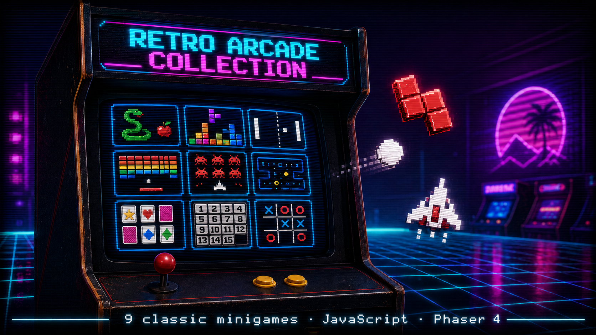

# 🕹️ Retro Arcade Collection — Phaser 4

> Una raccolta di 9 minigiochi arcade classici, porting della versione Python/Pygame, realizzati con **Phaser 4.1.0** (WebGL, ES Modules), con launcher unificato in stile retro CRT.


<p align="center">
  
</p>

<p align="center">
  <a href="https://siralfry.github.io/retro-arcade-collection-phaser/">
    
  </a>
</p>

---

## ✨ Highlights

- 🎮 **9 giochi classici** in un unico launcher con estetica retro (scanline CRT, palette neon, vignettatura)
- 🧠 **AI Minimax** integrata nel Tic Tac Toe con 3 modalità di gioco
- 🎨 **Architettura pulita**: ogni gioco è una `Phaser.Scene` indipendente, zero bundler
- 💾 **Persistenza degli high score** su `localStorage`
- 🌐 **Zero installazione**: basta un server HTTP statico e un browser moderno

## 🎮 Giochi inclusi

| Gioco | Caratteristiche principali |
|-------|---------------------------|
| **Snake** | Effetti particellari, gradiente colore sul corpo, frutto bonus a tempo |
| **Tetris** | Hold piece, ghost piece, preview, sistema di livelli, line clear animation |
| **Pong** | 3 modalità (1P, 2P, VS AI), effetto scia, AI con difficoltà variabile |
| **Breakout** | Mattoni a resistenza multipla, vite, accelerazione progressiva |
| **Space Invaders** | Nemici che sparano, ondate progressive, sistema vite |
| **Maze Runner** | Labirinti generati con DFS, 3 difficoltà, breadcrumb del percorso |
| **Memory Game** | Coppie 4×4, blocco input temporizzato, contatore mosse |
| **Puzzle 15** | Verifica risolvibilità, indicatore correttezza tessere, timer |
| **Tic Tac Toe** | AI Minimax, 3 modalità (1P random / 2P / AI), score tracking |

## 🚀 Avvio rapido

### Requisiti

- **Node.js** (qualsiasi versione recente) — solo per il server di sviluppo
- Oppure qualsiasi server HTTP statico (Live Server in VS Code, Python, ecc.)

### Setup

```bash
# Clona la repo
git clone https://github.com/sirAlfry/retro-arcade-collection-phaser.git
cd retro-arcade-collection-phaser

# Installa il server di sviluppo
npm install

# Avvia
npm run dev
```

Apri **http://localhost:3000** nel browser.

> ⚠️ **Il gioco usa ES Modules** e non funziona aprendo `index.html` direttamente dal filesystem (`file://`). Serve un server HTTP.

### Alternative senza Node

```bash
# Python 3
python -m http.server 3000

# oppure con VS Code: installa "Live Server" e clicca "Go Live"
```

## 🎯 Controlli del launcher

| Tasto / Input | Azione |
|---------------|--------|
| ⬆️ ⬇️ ⬅️ ➡️ | Naviga tra i giochi |
| `Invio` / `Spazio` / Click | Avvia il gioco selezionato |
| `C` | Mostra crediti |
| Mouse hover | Seleziona il gioco |

I controlli specifici di ogni gioco vengono mostrati nel pannello informativo in fondo al launcher e nel menu pausa (`ESC` durante il gioco).

## 🏗️ Architettura

```
retro-arcade-collection-phaser/
├── index.html                        # Entry point (carica src/main.js)
├── src/
│   ├── main.js                       # Phaser.Game config + lista scene
│   └── scenes/
│       ├── LauncherScene.js          # Menu principale retro CRT
│       ├── SnakeScene.js
│       ├── TetrisScene.js
│       ├── PongScene.js
│       ├── BreakoutScene.js
│       ├── SpaceInvadersScene.js
│       ├── MazeRunnerScene.js
│       ├── MemoryGameScene.js
│       ├── Puzzle15Scene.js
│       └── TicTacToeScene.js
├── package.json
└── README.md
```

### Pattern architetturali utilizzati

- **Scene Pattern**: ogni gioco è una `Phaser.Scene` indipendente. Il launcher usa `scene.start('NomeScene')` con fade in/out per le transizioni. Ogni scena gestisce autonomamente input, rendering e stato.
- **ES Modules nativi**: nessun bundler (Webpack, Vite, ecc.). Phaser 4 viene importato via CDN ESM (`jsDelivr`); il browser lo cacha automaticamente tra le scene.
- **Graphics API**: tutto il rendering usa `this.add.graphics()` con le API vettoriali di Phaser 4 (WebGL). Niente sprite sheet o asset esterni — i giochi sono completamente procedurali.
- **Persistenza disaccoppiata**: gli high score vengono salvati su `localStorage` con funzioni `loadScores()`/`saveScores()` locali a ogni scena, senza dipendenze condivise.

## 🛠️ Stack tecnologico

- **Linguaggio**: JavaScript (ES2022, ES Modules)
- **Game framework**: Phaser 4.1.0 (WebGL renderer)
- **CDN**: jsDelivr (`phaser.esm.min.js`)
- **Dev server**: `serve` (npm)
- **Persistenza**: `localStorage`

## 👤 Autore

**Alfredo De Donno** — Full-Stack Developer & Game Dev

- GitHub: [@sirAlfry](https://github.com/sirAlfry)
- LinkedIn: [Alfredo De Donno](https://www.linkedin.com/in/alfredo-de-donno-46b178210)
- ArtStation: [@siralfry](https://www.artstation.com/siralfry)
- Instagram (divulgazione tech): [@sir_alfry](https://www.instagram.com/sir_alfry)

## 📄 Licenza

Distribuito sotto licenza MIT. Vedi [LICENSE](LICENSE) per i dettagli.

---

<p align="center">
  <em>Fatto con ☕, Phaser 4 e nostalgia per le sale giochi anni '80.</em>
</p>
